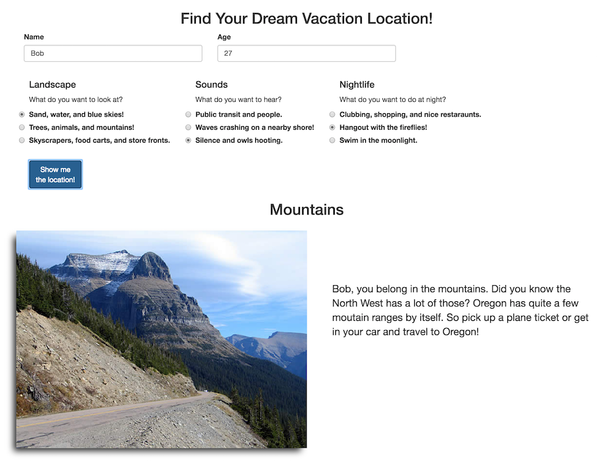

## Project Name
Vacation Finder

## Features
This is a quiz site to help the user choose which of three locations they should go on vacation.

##Technologies
Bootstrap, JS, JQuery

## Usage
To view the site, you can go to https://mehequanna.github.io/epicodus-project2.

To use the code, you can clone the repository at [https://github.com/Mehequanna/epicodus-project2](https://github.com/Mehequanna/epicodus-project2).

1. Download the repository.
2. Open index.html in your browser.

## Author
Stephen Emery

##License
This work can be used under the MIT License.
Copyright (c) 2016 Stephen Emery
